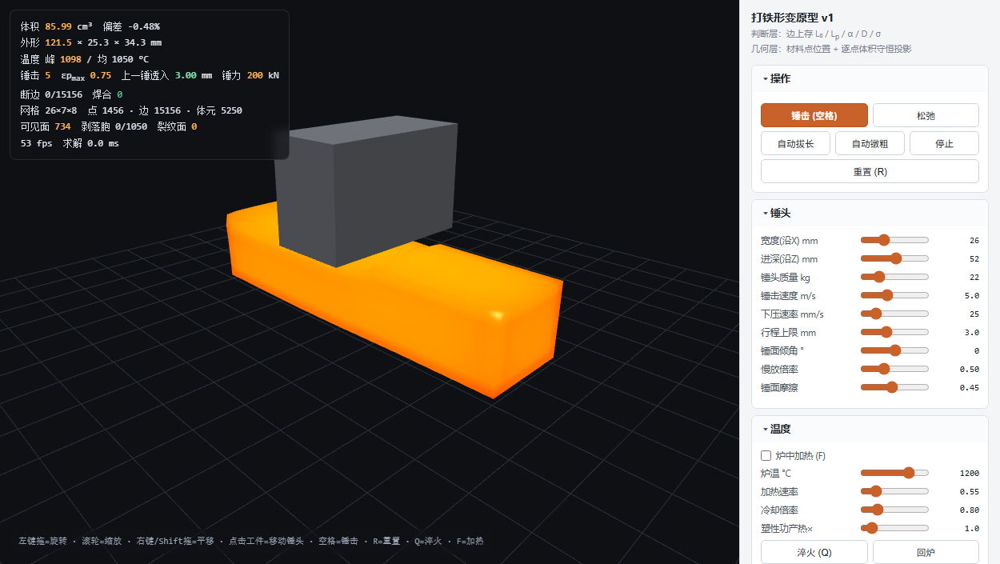
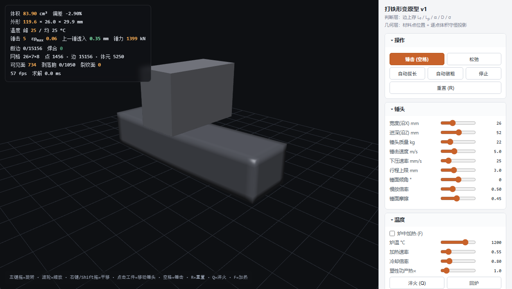

# forge3d — 硬核拟真打铁原型

一个**单文件、零构建、零外部依赖**的 WebGL2 打铁物理仿真 demo。核心卖点：不是脚本动画，而是真正的**热-力耦合塑性本构**——温度决定可锻性、体积守恒靠逐胞投影、断裂与锻接靠边级拓扑。双击 `index.html` 就能在浏览器里锻一块钢。

 

## 快速开始

用较新的 Chrome / Edge / Firefox 直接打开 `index.html` 即可（需要 WebGL2）。没有任何构建步骤。

也可以起个本地静态服务（可选，`file://` 下同样能跑）：

```bash
npx serve .          # 或 python -m http.server
```

## 操作

| 操作 | 键 / 鼠标 |
|---|---|
| 旋转视角 | 左键拖 |
| 缩放 | 滚轮 |
| 平移 | 右键拖 / Shift+拖 |
| 移动锤头 | 点击工件表面 |
| 锤击 | `空格` |
| 冲击测试（量抗冲击性） | `T` |
| 淬火 | `Q` |
| 炉中加热开关 | `F` |
| 重置 | `R` |

右侧面板有 30+ 参数（锤头、温度、砧面、材料、断裂、锻接、求解、网格、显示），每一段都有物理注释。

## 一键演示 / URL 参数

| 参数 | 效果 |
|---|---|
| `?showcase` | 一键演示剧本：热锻 → 淬火 → 冷打弹开 → 回炉 → 再锻 |
| `?demo=N` | 自动沿长边连击 N 次 |
| `?T=温度` | 设初始温度（默认 1150°C） |
| `?K=N` | 设剥落阈值 1–12（默认 4；1=激进剥落） |
| `?Q=N` | 先淬火到冷透，再连击 N 次（看淬火后打不动 / 弹开） |
| `?crack=0` | 关掉「断裂=两侧平贴面」，退回旧的删面行为（对比用） |
| `?show=0` | 开裂的料不渲染 |
| `?phys=1` | 强制用物理网格渲染 |

示例：

```
index.html?showcase               # 一键演示「温度决定可锻性」
index.html?demo=8&T=20&K=1        # 冷打 8 锤 + 激进剥落
index.html?Q=8                     # 淬火后锤 8 次（打不动，透入骤降）
index.html?Q=8&crack=0             # 同上但用旧行为对比
```

## 物理内核（为什么它「真」）

- **边本构**：边上存 `L₀ / Lₚ / α / D / σ / T / ξ`，用平滑屈服（smooth-min）、限速径向返回塑性流动、包辛格背应力、连续损伤。断边 = 单边接触面（只能压不能拉）。
- **逐胞体积守恒**：每个六面体胞拆 5 个四面体，PBD 投影约束到 `V₀`。实测各分辨率下体积偏差都稳定在 −0.06% 量级，与网格粗细无关。
- **温度决定可锻性**：`σy(T)` 随温度塌方一个数量级，动力学锤用冲量预算 `E₀ = ½mv²` 对撞材料抗力 `F = c·σy·A·bear`——热钢透入数 mm，冷钢/淬火件几乎打不动并开裂。
- **砧面物理**：导热（有热容、会被烤热、激冷随接触压力放大）、厚度约束因子 `c(h/2a)`、摩擦 hill、有限砧面（悬出端能被压弯）。
- **断裂 ≠ 消失**：断裂面是两个平贴面（解理面），体积不凭空丢失；`bear` 承载系数把「锻件有没有分层/裂纹」直接映射到抗冲击读数。
- **锻接 / 补边**：断边在「高温 + 贴合 + 受压」三条件持续成立后重连，焊合区残留损伤——锻造焊合的真实机制。

## 测试脚本（Node，无头跑物理内核）

```bash
npm test            # smoketest.js：6 项冒烟（静置/单锤/连击40/冷打/淬火/高压）
npm run perf        # perf.js：分辨率 × 性能探针
node anviltest.js   # 砧面导热 + 翻面对照
node thicktest.js   # 厚度效应 + 摩擦 hill 扫描
node finitetest.js  # 有限砧面悬出端压弯
node imptest.js     # 冲击测试 + 能量扫描（bear 承载系数）
node cracktest.js   # 断裂面体积守恒 A/B 测试
```

`cdp_shot.js` 用 CDP 驱动 Edge headless + SwiftShader 截图并 dump 诊断状态（依赖 `npm install` 装 `ws`）：

```bash
node cdp_shot.js "?demo=8" out.png 3000
```

## 目录结构

```
index.html      主交付物（单文件，~1900 行，含物理内核 + WebGL2 渲染 + UI）
smoketest.js    无头冒烟测试（npm test）
perf.js         分辨率 × 性能探针
anviltest.js / thicktest.js / finitetest.js / imptest.js / cracktest.js   专项对照实验
cdp_shot.js     CDP 截图工具（依赖 ws）
hot5.png / cold5.png   示例截图
```

## 路线图（未实现）

声音（随温度的锤击音色）、火花（含碳量）、折叠锻打（点级动态空间邻接）、异种钢融合（材料框架 + 结合度 + 碳扩散）、锻造纤维流线、多时钟（锤击慢放 / 冷却加速）。
